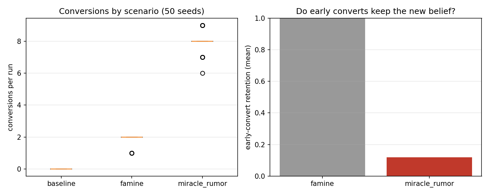
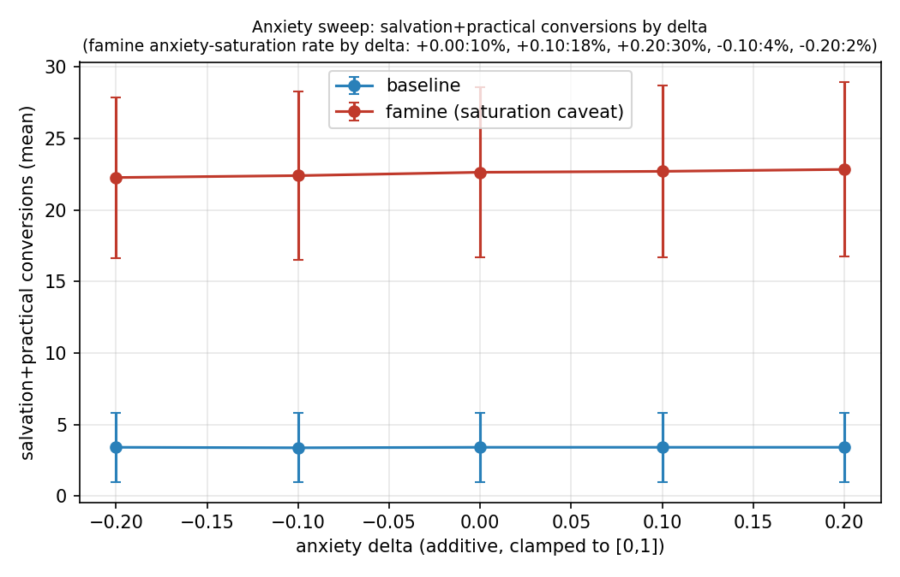
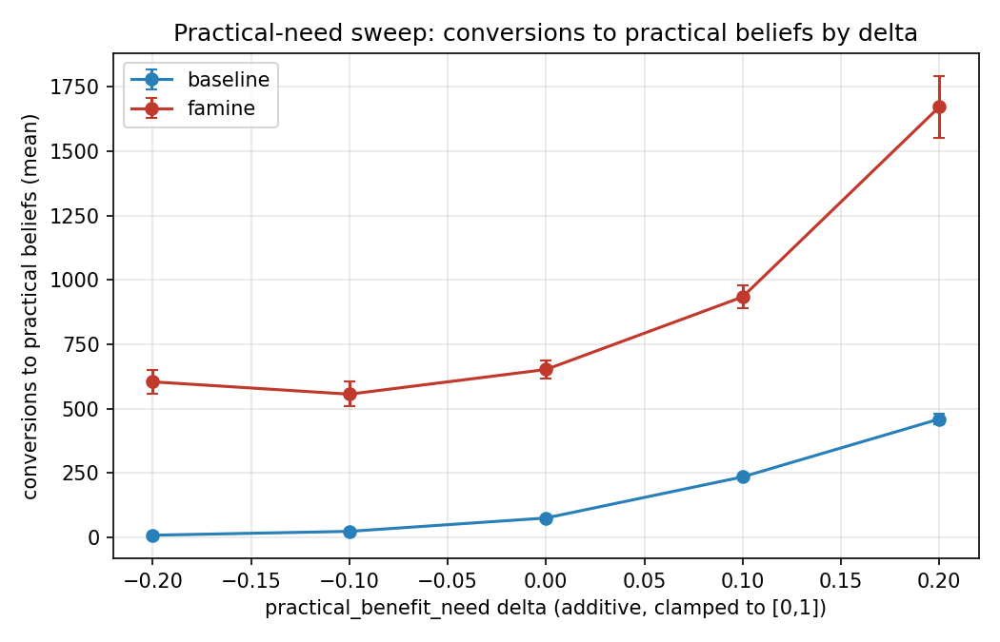
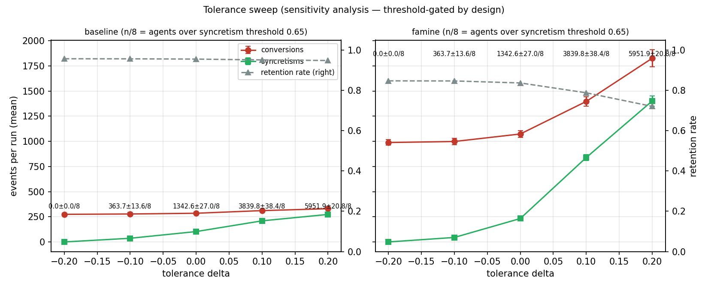
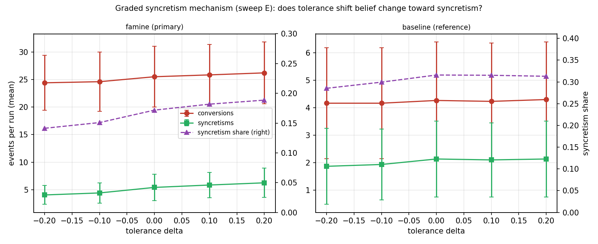
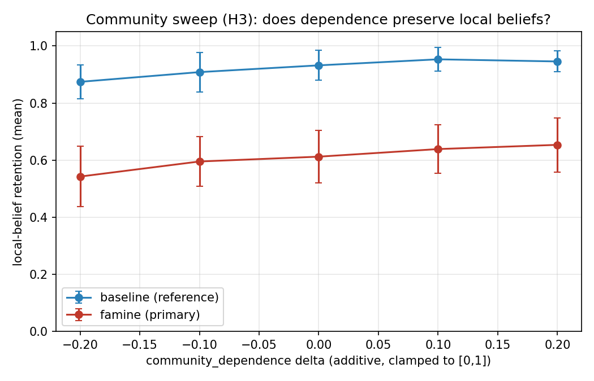
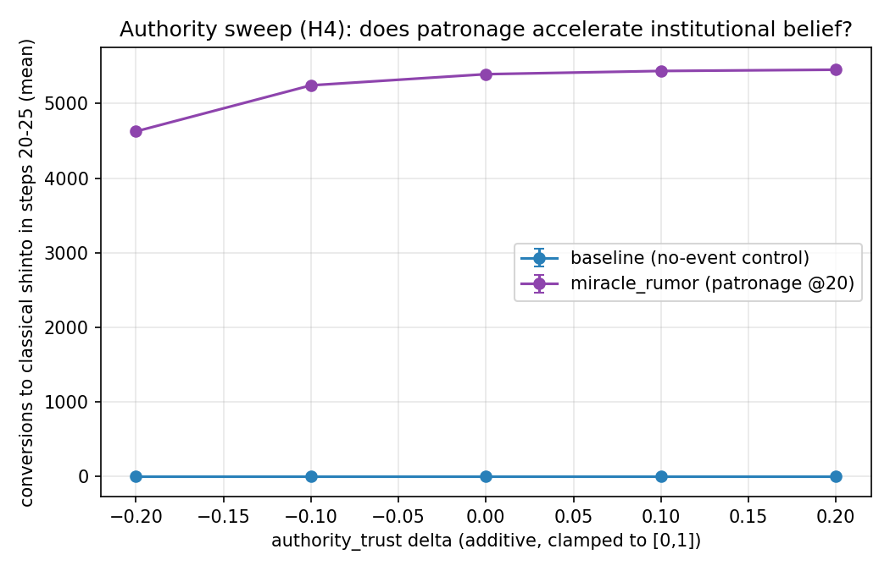

# religion-social-sim

日本の宗教の伝播と衰退を扱う社会シミュレーション（**再現性と誠実な報告を重視した ABM 実装実験**。学術研究ではありません——「このモデルが主張できること・できないこと」の節を参照）。

## このモデルの村で起きた、一番面白いこと

1. **改宗は「入口」で運命が決まる。** 危機（飢饉）をきっかけに改宗した村人は **98% が新しい信仰に定着**する。奇跡の噂をきっかけに改宗した村人は **約8割が元の信仰に戻る**。噂は危機の3倍の改宗を生むのに、ほぼ蒸発する
2. **危機は習合を許さない。** 平時の村では信仰変化の約3割が「神も仏も両方拝む」習合なのに、危機下では約1.5割に落ちる。強い危機は古い神を抱えたままの緩やかな変化を押し流し、完全改宗を強いる
3. **村人の心より、お上の一声。** 7つの実験で最大の効果量は、不安でも欲でも寛容さでもなく、**権威による制度的後押し**（神社への庇護）だった

これらは仮説リストに書く前のモデルから出てきたパターンであり（配線していない相互作用の産物）、村の構成を変えても再現する。検証の全コマンドは [再現方法](#再現方法) にある——**同じコードを動かせば byte 単位で同じ結果が出る**。

## 問い

- なぜ危機（飢饉・疫病）は人を新しい信仰へ向かわせるのか
- なぜ噂は爆発的に広がるのに、定着しないのか
- なぜ日本では「改宗」ではなく「習合」（神と仏を両方拝む）が起きるのか

村人エージェントが「不安・共同体の圧力・権威・噂・現世利益・救済欲求・世代交代」のもとで信仰を変え、混ぜ、捨てる過程を、決定的（再現可能）なエンジンでシミュレートし、パラメータスイープで仮説とモデル挙動の整合を検証した。seed ごとに別の60人の村をロール原型からサンプリングし、7スイープ・1,950 run で**6仮説すべてに判定**を出している（v1.0 で当初の問いに答え切り、本プロジェクトは一区切り。以降の拡張は「次フェーズ候補」のメニューから）。

## 仮説

[docs/hypotheses.md](docs/hypotheses.md) の6仮説のうち、以下を実験対象とした。

- **H1**: 高い不確実性と苦難は、救済志向の信念を増やす
- **H2**: 農業・商業の圧力は、現世利益の祈願を増やす
- **H5**: 噂は急速な伝播を生むが、定着は共同体と実利的な見返りに依存する
- **H3**: 強い共同体依存は、地域の神社や家の信仰を保存する（v0.7.0）
- **H4**: 権威による庇護は、制度と結びついた信念を加速させる（v0.7.0）
- **H6**: 高い寛容性は、明確な改宗ではなく習合（シンクレティズム）を生む（v0.6.0 の graded メカニズムで初めて検証可能になった）

v0.7.0 で6仮説すべてに専用の実験と判定が揃った。

## 手法

- 決定的エンジン（同一 seed なら同一結果）。改宗イベント全件に理由トレース付き
- **母集団サンプリング（v0.5.0）**: 7つのロール原型（農民24・家内12・商人6・職人6・宗教者6・村役3・古老3）から seed ごとに別の60人の村を決定的に生成（`population.yaml` + `sim_core/population.py`）。mean/std は「村ごとの違い + 確率的ばらつき」を意味する（v0.4.0 の固定村とは測定対象が異なる）
- 7本のパラメータスイープ、計 **1,950 run**（`experiments/run_sweep.py`）:

| スイープ | 軸 | 目的 |
|---|---|---|
| A | 3シナリオ × seed 1–50 | H1/H5 の検証（シナリオ間比較） |
| B | {baseline, famine} × 寛容度デルタ 5段階 × seed 1–30 | 感度分析（threshold では H6 検証不能） |
| C | {baseline, famine} × 不安デルタ 5段階 × seed 1–30 | H1 の補助検証 |
| D | {baseline, famine} × 実利欲求デルタ 5段階 × seed 1–30 | H2 の検証 |
| E | {baseline, famine} × 寛容度デルタ 5段階 × seed 1–30（**graded**） | **H6 の検証**（v0.6.0） |
| F | {baseline, famine} × 共同体依存デルタ 5段階 × seed 1–30 | **H3 の検証**（v0.7.0） |
| G | {baseline, miracle_rumor} × 権威信頼デルタ 5段階 × seed 1–30 | **H4 の検証**（v0.7.0） |

- **習合メカニズムは2種類をフラグで版管理**（v0.6.0）: H1/H2/H5 は従来の **threshold** メカニズム（習合が寛容度 ≥ 0.65 の二値ゲートで決まる）で検証済み。このゲートは「寛容なら習合する」をコードの定義にしてしまうため、H6 の検証には使えない（トートロジー）。**H6 のみ graded** メカニズムで検証する——改宗の瞬間に「旧信仰を保持するか捨てるか」を競合スコア（寛容 0.50 + 旧信仰への愛着 0.30 + 伝統 0.20 vs 新信仰の引力（観測p90で正規化）+ 新奇 0.35）で決め、寛容性は勝敗を保証しない一要因になる。重みは threshold 実験の改宗時引力分布（中央値 0.18 / p90 0.29、450件）から較正し、**スイープ E 実行前に凍結**した。全スイープの graded 移行と両メカニズム比較は次フェーズ
- 特性の介入は**加算デルタ**（±0.20、0–1 にクランプ。乗算は上限張り付きで条件差が潰れるため不採用）
- 判定基準（数値閾値）は**実装前に宣言**し、結果を見てから動かしていない（v0.4.0: [docs/design_history/2026-06-05-sweeps-v0.4.md](docs/design_history/2026-06-05-sweeps-v0.4.md) / v0.5.0: [docs/design_history/2026-06-05-population-v0.5.md](docs/design_history/2026-06-05-population-v0.5.md) / v0.6.0: [docs/design_history/2026-06-06-syncretism-v0.6.md](docs/design_history/2026-06-06-syncretism-v0.6.md)）。判定語は「整合 / 不整合 / 判定不能」を使い、「証明」「支持」は使わない
- v0.5.0 の絶対下限は v0.4.0 と **per-capita 完全パリティ（25% = 15/60件）**。v0.4.0 実測の単純スケール（famine ≈ 13.5件）では届かない側の基準であり、「通りやすい閾値を選んだ」という批判は構造的に成立しない
- **後方互換**: `--population fixed8` で v0.4.0 の8人村実験を byte 一致で再現できる（タグ `v0.4.0` との diff で検証済み）

## 実験結果

数値は全て 60 人村（v0.5.0）。8人固定村（v0.4.0）の結果と判定は [docs/experiment_log.md](docs/experiment_log.md) の対比表を参照（測定対象が異なるため直接比較不可）。

### 危機は改宗を生み、それは定着する。噂も改宗を生むが、蒸発する（スイープA）



| シナリオ | 改宗数 mean±std（50村） | 早期改宗の定着率 | 最終定着率（初期信仰の保持） |
|---|---|---|---|
| baseline | 3.82 ± 1.86 | 1.000 | 0.936 |
| famine | 22.70 ± 4.57 | **0.983**（ほぼ全員が新信仰を維持） | 0.631 |
| miracle_rumor | 68.46 ± 4.37 | **0.222**（約8割が新信仰を放棄） | 0.202 |

- **H1: 整合** — famine の改宗 mean 22.70 ≥ 下限15（per-capita パリティ）、> baseline mean+1σ = 5.68、改宗先の **99.5% が救済系（浄土仏教）+ 実利系（稲荷・龍神）**。v0.4.0（8人村）では不整合だったが、60人村では素直なスケール予想（13.5件）を大きく超えた——「規模の増幅効果」の節を参照
- **H5: 整合** — 噂イベント直後5ステップで平均 19.4 件の改宗（≥ 15）を生むが、その約8割が最終的に離脱（定着率 0.222 ≤ 0.5）。村の構成が変わっても「噂改宗は蒸発する」は頑健

### 不安は改宗の「引き金」ではなく「感度」だった（スイープC）



不安特性を ±0.20 動かしても、baseline 側の救済+実利系改宗は **3.37〜3.40 で実質フラット**。宣言した単調増加基準（隣接減少1以下）は形式上満たすが、効果量はほぼゼロであり、**平坦系列を排除できない基準の欠陥**として記録した（実験ログ参照）。famine 側も 22.4 → 23.0 の微増のみ。結論は v0.4.0 と同じ：**不安単独では改宗は起きず、危機イベントが作る「信念間の引力差」が駆動因子**。不安は引き金が引かれたときの感応度を変えるだけである。

### 実利欲求は平時でも効く。そして救済欲求と競合する（スイープD）



**H2: 整合**（v0.4.0 の条件付き整合から昇格）。実利欲求デルタを上げると実利系（稲荷・龍神）への改宗が baseline 側 0.20 → 5.63、famine 側 10.07 → 31.40 と**両シナリオで単調増加**。さらに新しい発見として、実利系が増えるほど**救済系（浄土仏教）への改宗は減る**（famine: 12.83 → 5.73）。救済と実利は危機対処の競合チャネルになっている。

### 寛容性は信仰地図を「安定」させない。むしろ流動化させる（スイープB・感度分析）



寛容度を上げると（famine 側）習合が 0 → 10.5 件に増えるだけでなく、**正面改宗も 21.8 → 29.9 に増え、定着率は 0.641 → 0.512 に低下**。「寛容だから変わらない」のではなく「寛容だから動きやすい」。8人村では閾値跨ぎ人数が 0/8 → 8/8 の離散ジャンプだったが、60人村では 0 → 56人 のなめらかな勾配になり、この傾向がアーティファクトでないことを補強した。ただしこのスイープは習合の発生条件（寛容度 ≥ 0.65 の閾値ゲート）に直結したトートロジーを含むため**感度分析**であり、H6 の検証ではない。

### 寛容性は信仰変化を習合側へ傾ける——ただし「置き換え」ではなく「共増加」（スイープE・graded・H6）



**H6: 整合（弱い読み）** — 二値ゲートを外した graded メカニズムの下で、寛容度デルタを上げると famine 側の習合は 4.07 → 6.27 件、**信仰変化に占める習合の割合は 14.1% → 18.9%** と、宣言した3基準（習合数の単調増加・習合シェアの単調増加・効果量下限 ≥3）を全て満たした。ただし完全改宗も微増（24.4 → 26.2）する**共増加型**であり、「習合が改宗を置き換える」という強い読みではなく「寛容性は信仰変化の総量を増やしつつ、その構成を習合側へ傾ける」という弱い読みでの整合である。

さらに面白いのは平時との対比：**baseline では信仰変化の約3割（28.5–31.6%）が習合なのに、famine では14.1–18.9% に下がる**。強い危機の引力は keep/drop の綱引きで「捨てる」を勝たせるため、危機は古い神を抱えたままの緩やかな変化を許さず、完全改宗を強いる。

### 共同体依存は危機下でも地域信仰を守った——雪崩への反転は起きなかった（スイープF・H3）



**H3: 整合**。共同体依存には逆方向の2チャネル——多数派に引き留める力と、自分が少数派になった瞬間に改宗を加速する力——があり、危機下では後者が勝って「依存が高いほど崩れる」反転が**設計段階から懸念されていた**。結果は famine 下で保持率 54.3% → 65.4% の単調増加（効果量 11.1pp ≥ 下限5pp）。引き留めチャネルが勝ち、共同体依存は危機下でも地域信仰（氏神・古典神道）の防波堤として働いた。

### 権威の庇護は強烈に効く（スイープG・H4）



**H4: 整合**。神社庇護イベント（step 20）後の5ステップで、古典神道への改宗は権威信頼デルタに対し 25.1 → 48.2 件と単調増加（±0.20 で約2倍）。**イベントのない baseline の同窓は全条件で0件**——測った改宗はすべて庇護イベント由来である（妥当性チェック成立）。今回の7スイープで最も効果量の大きい介入は、個人特性ではなく「権威による制度的な後押し」だった。

## 発見の要約

| 仮説 | v0.4.0（8人固定村） | v0.5.0/v0.6.0（60人サンプリング村） | 根拠 |
|---|---|---|---|
| H1 危機→救済志向 | 不整合（1.80 < 2） | **整合** | 22.70 ≥ 15、改宗先99.5%が救済+実利 |
| H2 実利圧力→現世利益 | 条件付き整合 | **整合** | 両シナリオで単調増加（0.20→5.63 / 10.07→31.40） |
| H3 共同体→保存 | 判定不能 | **整合**（v0.7.0） | famine 下で保持率 0.543→0.654 単調増加（11.1pp）。雪崩チャネルは勝てず |
| H4 権威→制度信仰 | 判定不能 | **整合**（v0.7.0） | 庇護後改宗 25.1→48.2 単調増加。baseline 対照は全条件0件 |
| H5 噂は速いが定着しない | 整合 | **整合** | 早期改宗 19.4 件 / 定着率 22.2% |
| H6 寛容→習合 | 判定不能 | **整合（弱い読み・graded）** | 習合シェア 14.1%→18.9% 単調増加。共増加型＝「置き換える」でなく「傾ける」。アブレーションで tolerance チャネルへの帰属を確認 |

**注**: H1/H2/H4/H5 の「方向性」はモデル設計に配線されており（H4 は shrine_patronage の target_belief 定義）、判定は定量面（構成比・規模・単調応答・対照分離）に限る。H3 は逆方向チャネルの綱引きで構造上落ちうる検証だった。6/6 整合は配線の帰結を含むため誇張しない。詳細は「このモデルが主張できること・できないこと」を参照。

モデルから出た最も面白い創発的知見は、仮説リストになかったものだった：

1. **改宗の「入口」によって定着率がまったく違う**（危機経由 98% 定着 vs 噂経由 78% 蒸発）。村の構成が変わっても頑健
2. **規模の増幅効果**: famine の per-capita 改宗率が 8人村 22.5% → 60人村 37.8%。最初の改宗者が共同体圧力チャネルを通じて後続を呼ぶ連鎖は、村が大きいほど強く働く
3. **救済と実利は競合する対処チャネル**: 実利欲求が強い村では実利系改宗が増え、救済系改宗が減る
4. **個人特性（不安）は単独では改宗を起こせず、イベントとの掛け算でだけ効く**
5. **寛容性は安定装置ではなく流動化装置**
6. **危機は習合を許さない**（v0.6.0）: 平時の信仰変化は約3割が習合だが、危機下では約1.5割に下がる。強い引力は「古い神を抱えたままの変化」を許さず完全改宗を強いる

## このモデルが主張できること・できないこと

独立の批判レビュー（2026-06-06、落とす前提の査読スタイル）を受けて、主張の射程を明示する。

**できないこと（配線の開示）:**
- **H1/H2 の「方向性」は設計に配線されている**。イベント定義（飢饉→稲荷、疫病→浄土仏教に向けてシグナルを発する）と特性マッピング（救済欲求→浄土系の訴求、実利欲求→稲荷系の訴求）が結論の方向をほぼ決めている。判定基準が検証していたのは方向性ではなく**定量面**（改宗先の構成比・規模・デルタへの単調応答・baseline との差）である
- 「噂は蒸発する」「改宗の入口で定着が違う」も、シナリオに権威イベント（神社庇護・寺スキャンダル）を置いた設計の影響を含む。純粋な噂の自然減衰との分離は未実施
- 全パラメータ（村人の特性値・イベント強度）は**歴史史料に基づかない設計上の仮定**であり、出典となる学術文献はまだ参照していない。判定語の「整合」は「このモデルの中で、宣言した定量基準を満たした」以上を意味しない
- 設計レビュー・検証は AI（Claude 系統の evaluator、初期は OpenAI Codex）による内部レビューであり、人間の第三者査読は受けていない

**主張できること:**
- 宣言済み基準による定量判定と、その完全な再現性（byte 一致）
- 配線していない相互作用から出た創発パターン: 規模の増幅効果、救済と実利の競合（クラウディングアウト）、危機が習合を抑制する効果
- H6 は**アブレーションで寄与を分離済み**: tolerance の寄与をゼロ化すると習合シェアはデルタに対し完全フラット（8.6%）になり、本実験の 14→19% の応答は tolerance チャネルに帰属する（習合を約2〜3倍に押し上げる）。これは創発の証明ではなく寄与の定量分離である

このリポジトリの正確な位置づけは「学術研究」ではなく、**再現性と誠実な報告を重視した宗教伝播 ABM の実装実験**である。

## 限界

- **1つの村落類型にすぎない**。60人へのサンプリングで「村ごとの違い」は表現できるようになったが、ロール構成比（農民24・家内12…）自体は1つの原型に固定。また v0.5.0 の mean/std は「村間ばらつき + 確率的ばらつき」の混合であり、その分解（村固定×seed の直交設計）は未実施。統計量は記述統計（mean/std）であり検定はしていない
- **単調増加の判定基準は平坦系列を排除できない**（スイープCで顕在化）。効果量の下限を加えるのが次フェーズ課題
- **歴史の再現ではない**。モデル内実験であり、判定語の「整合」は「このモデルの挙動が仮説と矛盾しない」以上を意味しない
- **H6 の「整合」はミクロに寛容性を含むメカニズムの上での話**。graded メカニズムでも寛容性は keep スコアの一要因（重み0.50）として入っており、判定対象はあくまで「マクロな置換パターンが観察されたか」。競合要因（旧信仰の強度・伝統・引力・新奇）により仮説が落ちる余地は構造的にあるが、「寛容性と無関係なメカニズムから習合が創発した」わけではない。また keep/drop スコアのスケールは非対称（keep 最大 1.00 / drop 最大 1.35。強い危機は愛着を押し流すという設計判断）
- **2つの習合メカニズムが併存している**。H1/H2/H5 は threshold、H6 は graded で検証した。全スイープの graded 移行と相互比較は次フェーズ課題
- **miracle_rumor シナリオには交絡がある**。step 20 の神社庇護・step 34 の寺スキャンダルが含まれ、揺り戻しは「噂の自然減衰」と「権威イベントの引き戻し」の複合。早期窓（step 5–10）の測定は庇護イベント前なので汚染されない
- **baseline の good_harvest（不安 -0.20）はスイープCのデルタと逆方向に働く**。ただし全条件に同一に作用するため条件間比較は成立する

## 再現方法

```bash
# 全スイープ（60人村 × 1,350 run、1分強）+ 宣言済み基準での仮説判定
.venv/bin/python experiments/run_sweep.py --sweep all --judge

# H6 のみ（スイープ E、graded 習合メカニズム、300 run）
.venv/bin/python experiments/run_sweep.py --sweep tolerance_graded --judge

# v0.4.0 の8人固定村実験の再現（outputs/sweeps_fixed8/ に出力、タグ v0.4.0 と byte 一致）
.venv/bin/python experiments/run_sweep.py --sweep all --population fixed8 --judge

# 図の再生成
.venv/bin/python experiments/plot_sweeps.py
```

- 出力は決定的：同じコードなら `outputs/sweeps/*/results.tsv` は何度実行しても byte 一致する
- run ごとの生ログは `outputs/sweeps/<sweep>/runs/<run_id>/`（git 管理対象外）、集計は `results.tsv` / `stats.json`（コミット済み）。各 run の `summary.json` に `population_mode` / `population_seed` を自己記述
- 判定基準の宣言と設計レビューの経緯は v0.4.0: [docs/design_history/2026-06-05-sweeps-v0.4.md](docs/design_history/2026-06-05-sweeps-v0.4.md) / v0.5.0: [docs/design_history/2026-06-05-population-v0.5.md](docs/design_history/2026-06-05-population-v0.5.md)、実験ログは [docs/experiment_log.md](docs/experiment_log.md)

## コンセプト

公開されている社会シミュレーションプロジェクトの2つのパターンを組み合わせています（[docs/references.md](docs/references.md)）。

- 実験ファーストのスクリプトとパラメータスイープ：`cygkichi/my-social-agents` を参考。
- 再利用可能なコア + 差し替え可能なドメインパック：`karesansui-u/hackathon-singulab` を参考。

最初のドメインは `japan_religion` です。

## セットアップ

```bash
cd religion-social-sim
python3 -m venv .venv
.venv/bin/python -m pip install --upgrade pip
.venv/bin/python -m pip install -e ".[test,analysis]"
```

## 単発実行

```bash
.venv/bin/python experiments/run_scenario.py \
  --domain domain_packs/japan_religion \
  --scenario famine.yaml \
  --output-dir outputs/runs/famine_run \
  --seed 42
```

シナリオは `baseline.yaml`（基準）、`famine.yaml`（飢饉）、`miracle_rumor.yaml`（奇跡の噂）の3つ。同じ seed なら結果は決定的（再現可能）。

### LLM ナラティブ生成（任意）

実行結果から「村で何が起きたか」の日本語の観察記録を LLM に書かせることができます。

```bash
# Claude Code CLI を使う場合
.venv/bin/python experiments/run_scenario.py \
  --scenario famine.yaml --output-dir outputs/runs/famine_narrated \
  --narrate claude --narrate-model haiku

# ローカル Ollama を使う場合
.venv/bin/python experiments/run_scenario.py \
  --scenario famine.yaml --output-dir outputs/runs/famine_narrated \
  --narrate ollama --narrate-model qwen2.5:7b
```

出力先に `narrative.md` が追加されます。LLM なし（デフォルト）でもシミュレーション自体は完全に動作します。

### ブラウザビューア

実行結果を村の地図として再生できるビューアを生成できます。

```bash
.venv/bin/python experiments/render_viewer.py --run outputs/runs/famine_run
open outputs/runs/famine_run/viewer.html
```

- 村人は自分の信仰に対応する場所（神社・寺・市場・田んぼなど）の周りに立ち、改宗すると移動する
- 色＝信仰、大きさ＝信仰の強さ、リング＝習合（副次信仰）
- 再生／停止・速度変更・ステップスライダー・村人クリックで詳細表示
- `viewer.html?step=30` のように URL で開始ステップを指定可能
- 単一 HTML ファイルなのでダブルクリックでそのまま開ける（サーバー不要）

## 出力ファイル

| ファイル | 内容 |
|---|---|
| `agent_turns.tsv` | ステップ × エージェントの生ログ（信仰・強度・不安・改宗圧力） |
| `belief_shares.tsv` | ステップごとの信仰別の信者数・平均強度 |
| `conversions.tsv` | 改宗・習合イベント（全件に理由トレース付き） |
| `events_log.tsv` | 発火したシナリオイベント |
| `summary.json` | 最終状態の集計（改宗数・定着率・最終分布） |
| `narrative.md` | `--narrate` 指定時のみ。LLM による日本語の観察記録 |
| `viewer.html` | `render_viewer.py` 実行時のみ。ブラウザで再生できる村マップ |
| `results.tsv` / `stats.json` | スイープ実行時。run ごとの集計と条件ごとの統計 |

## テスト

```bash
.venv/bin/python -m pytest
```

`validation/validation_plan.md` の5項目（baseline 安定／飢饉で実利・救済系が増加／噂で短期改宗圧力／改宗理由トレース必須／生ログと集計の分離）、スイープ機能（特性デルタの適用とクランプ・既存挙動の不変・results.tsv の決定性・早期改宗定着率の計算）、母集団生成（spec バリデーション・決定性・golden fixture・agents_rows 注入）、graded 習合メカニズム（keep/drop 境界例・決定性・既定 threshold の不変・stats キー）をテストとして固定しています（計50件。H3/H4 の指標計算・スキーマ防御を含む）。

## 構成

```text
sim_core/
  ドメインに依存しないシミュレーションのコア（engine / population / llm_backend）。

domain_packs/japan_religion/
  日本の宗教データ、プロンプト、シナリオ、バリデーション、ビューア設定。

experiments/
  シナリオ実行（run_scenario.py）、スイープ（run_sweep.py）、
  図表生成（plot_sweeps.py）、ビューア生成（render_viewer.py）。

outputs/runs/
  単発実行の出力先。中身は git 管理対象外。

outputs/sweeps/
  スイープの集計（results.tsv / stats.json / figures はコミット、runs/ は対象外）。

docs/
  設計メモ、仮説、実験ログ、参考文献。

visualization/
  ブラウザビューアのテンプレート。
```

## 現在のスコープ（v1.0.0・完結）

- ドメイン1つ：`japan_religion`
- 信念タイプ 7 種、村人 60 人（7ロール原型から seed ごとにサンプリング。8人固定村も `--population fixed8` で再現可）
- シナリオ 3 つ：baseline（基準）、famine（飢饉）、miracle rumor（奇跡の噂）
- 決定的なステップ実行エンジン：イベント減衰、信念スコア（訴求×特性・共同体圧力・慣性）、改宗・習合判定、理由トレース、特性デルタ介入、エージェント注入
- パラメータスイープ 7 本（1,950 run）と宣言済み基準による仮説判定（`--judge`）。**6仮説すべてに判定済み**
- 習合メカニズム2種（threshold / graded）のフラグ版管理。公表済み結果は両タグと byte 一致で再現可
- LLM ナラティブ生成（claude CLI / Ollama、任意）

これはまだ歴史の再現ではありません。目標は、伝播メカニズムを観察できる「検証可能な装置」を作ることです。

## 次フェーズ候補

- スイープ A–D の graded 移行と両メカニズムの全面比較
- 副次信仰の減衰・棄教メカニズム（現状は一度習合すると保持され続ける）
- 分散の分解（村固定 × シミュレーション seed の直交設計）と統計的検定の導入
- エージェント単位の LLM「観測器」判断（hackathon-singulab の観測器プロンプト方式）
