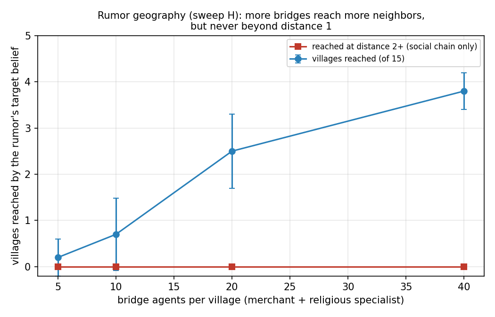

# religion-social-sim

> **状態: 休眠中（最終更新 2026-06）**。これは凍結されたスナップショットです。作業を再開する際は readme-template に沿って README を再整備してから進めてください。

日本の宗教の伝播と衰退を扱う社会シミュレーション（**再現性と誠実な報告を重視した ABM 実装実験**。学術研究ではありません——「このモデルが主張できること・できないこと」の節を参照）。

**▶ デモ: [ブラウザで村の50日を再生する](https://yyuki611-glitch.github.io/religion-social-sim/demo/viewer.html)**（60人村・飢饉シナリオ。色＝信仰。改宗すると村人が居場所を移す。再生ボタンでどうぞ）

## この郡で起きた、一番面白いこと

1. **噂は隣村止まり。** 16の村を御師・行商が繋ぐ郡（6,400人）で奇跡の噂を流すと、橋渡し役を8倍に増やしても、噂の信仰は**2つ先の村に一度も届かなかった**（40 run 中ゼロ）。広がりは「発生村＋隣接何村か」を御師の数が決める
2. **改宗は「入口」で運命が決まる。** 危機をきっかけに改宗した村人はほぼ定着するが、噂をきっかけの改宗者は**9割以上が元の信仰に戻る**。この対比は村の規模・構造を変えても頑健
3. **村の結束は守り神にも雪崩にもなる。** 60人村では「共同体依存が地域信仰を守る」一方向だったが、400人の村では**依存が強すぎると保持率が反転下降**する山型が初めて現れた（多数派引き留めと少数派雪崩の綱引き）
4. **村人の心より、お上の一声。** 全実験で最大の効果量は、不安でも欲でも寛容さでもなく、**権威による制度的後押し**（郡全域への神社庇護）だった

検証の全コマンドは [再現方法](#再現方法) にある——**同じコードを動かせば byte 単位で同じ結果が出る**。

## 問い

- なぜ危機（飢饉・疫病）は人を新しい信仰へ向かわせるのか
- なぜ噂は爆発的に広がるのに、定着しないのか
- なぜ日本では「改宗」ではなく「習合」（神と仏を両方拝む）が起きるのか

- そして v2.0 の新しい問い: **噂・信仰は村から村へどう旅するのか**（伝播の地理）

村人エージェントが「不安・共同体の圧力・権威・噂・現世利益・救済欲求・世代交代」のもとで信仰を変え、混ぜ、捨てる過程を、決定的（再現可能）なエンジンでシミュレートし、パラメータスイープで仮説とモデル挙動の整合を検証する。

## なぜ「郡」か、なぜ江戸か

- **なぜ郡か**: このモデルの共同体メカニズムは「全員がお互いの信仰を見ている」ことを前提にする。それが成り立つのは村の規模（江戸の平均的な村 = 40〜50戸・約400人）まで。人数を増やすには「大きな村」ではなく**村の集まり＝郡**へ構造を変える必要がある。v2.0 は 16村×400人 ≈ 6,400人。村内は全員顔見知り、村と村は**御師・講・旅僧・行商**（史実の村間ネットワークの担い手）に対応する橋渡し役（宗教者・商人）だけが繋ぐ
- **なぜ江戸か**: (1) 神仏習合が「日常」だった最後の時代（奈良で形成・平安で理論化・**明治の神仏分離令で人為的に終了**）、(2) 宗門人別改帳により村レベルの人口記録が残る最古の時代、(3) 村が閉じた共同体で「全員顔見知り」の仮定が最も成り立つ、(4) 飢饉（天明・天保）や **お蔭参り・ええじゃないか**（噂駆動の集団宗教行動が数ヶ月で沈静化）という、モデルのイベントに対応する史実が存在する。出典は [docs/references.md](docs/references.md)
- 寺請制度下では全員が檀家+氏神の氏子（信仰の併存が標準）のため、モデルの「信仰」は所属ではなく**「主たる信心」**（日々の心の重心）と解釈する

## 仮説

[docs/hypotheses.md](docs/hypotheses.md) の6仮説のうち、以下を実験対象とした。

- **H1**: 高い不確実性と苦難は、救済志向の信念を増やす
- **H2**: 農業・商業の圧力は、現世利益の祈願を増やす
- **H5**: 噂は急速な伝播を生むが、定着は共同体と実利的な見返りに依存する
- **H3**: 強い共同体依存は、地域の神社や家の信仰を保存する（v0.7.0）
- **H4**: 権威による庇護は、制度と結びついた信念を加速させる（v0.7.0）
- **H6**: 高い寛容性は、明確な改宗ではなく習合（シンクレティズム）を生む（v0.6.0 の graded メカニズムで初めて検証可能になった）

v0.7.0 で6仮説すべてに専用の実験と判定が揃った。

## 手法

- 決定的エンジン（同一 seed なら同一結果）。改宗イベント全件に理由トレース付き
- **郡モデル（v2.0）**: `district.yaml` の7ロール原型（農民300・家内48・職人16・商人12・宗教者8・古老12・村役4 = 1村400人。百姓系約9割は身分別人口の史実に整合）から、seed ごとに別の16村=6,400人の郡を決定的に生成。4×4格子の隣接グラフ。共同体のシェアは**自村内**で計算し、橋渡し役（宗教者・商人）だけが隣接村を重み0.5で知覚する。噂イベントは**1つの村（V06）で発生**し、直接届くのは隣接村の橋渡しまで（距離1）——それ以遠への伝播は改宗連鎖のみで決まる
- 9本のパラメータスイープ（A–H, S）、seeds 1–10（N≈6,400 で分散が±0.004 まで縮む実測に基づき削減）:

| スイープ | 軸 | 目的 |
|---|---|---|
| A | 3シナリオ × seeds | H1/H5 の検証 |
| B | 寛容度デルタ（threshold） | 感度分析 |
| C | 不安デルタ | H1 の補助検証 |
| D | 実利欲求デルタ | H2 の検証 |
| E | 寛容度デルタ（**graded**） | H6 の検証 |
| F | 共同体依存デルタ | H3 の検証 |
| G | 権威信頼デルタ | H4 の検証 |
| **H** | **橋渡し人数 {5,10,20,40}/村 × 噂** | **Q4 伝播地理（記述的報告）** |
| **S** | **初期信仰分布の摂動 5バリアント** | **判定のロバスト性検査** |

- **習合メカニズムは2種類をフラグで版管理**（v0.6.0）: H1/H2/H5 は従来の **threshold** メカニズム（習合が寛容度 ≥ 0.65 の二値ゲートで決まる）で検証済み。このゲートは「寛容なら習合する」をコードの定義にしてしまうため、H6 の検証には使えない（トートロジー）。**H6 のみ graded** メカニズムで検証する——改宗の瞬間に「旧信仰を保持するか捨てるか」を競合スコア（寛容 0.50 + 旧信仰への愛着 0.30 + 伝統 0.20 vs 新信仰の引力（観測p90で正規化）+ 新奇 0.35）で決め、寛容性は勝敗を保証しない一要因になる。重みは threshold 実験の改宗時引力分布（中央値 0.18 / p90 0.29、450件）から較正し、**スイープ E 実行前に凍結**した。全スイープの graded 移行と両メカニズム比較は次フェーズ
- 特性の介入は**加算デルタ**（±0.20、0–1 にクランプ。乗算は上限張り付きで条件差が潰れるため不採用）
- 判定基準（数値閾値）は**実装前に宣言**し、結果を見てから動かしていない（v0.4.0: [docs/design_history/2026-06-05-sweeps-v0.4.md](docs/design_history/2026-06-05-sweeps-v0.4.md) / v0.5.0: [docs/design_history/2026-06-05-population-v0.5.md](docs/design_history/2026-06-05-population-v0.5.md) / v0.6.0: [docs/design_history/2026-06-06-syncretism-v0.6.md](docs/design_history/2026-06-06-syncretism-v0.6.md)）。判定語は「整合 / 不整合 / 判定不能」を使い、「証明」「支持」は使わない
- 絶対下限は per-capita パリティを N ごとに引き継ぐ（v2.0: H1=6,400×25%=1,600 / H5=発生村400×25%=100）。**凍結前パイロットで「届かない見込み」と分かったが動かさず凍結**し、不整合をそのまま報告している（基準は予言ではなく物差し）
- **後方互換**: `--population fixed8 / sampled60` で v0.4.0 / v0.5.0 の実験を byte 一致で再現できる（`scripts/verify_legacy_bytes.sh`。全タグと diff 検証済み）

## 実験結果

数値は全て郡（16村×400人、v2.0）。60人村（v0.5–v1.0）の結果と判定は [docs/experiment_log.md](docs/experiment_log.md) の対比表を参照（共同体シェアの計算単位が変わったため**直接比較不可**）。

### 噂は隣村止まり——御師を増やしても、二つ先の村には届かない（スイープH・Q4）



噂（稲荷の奇跡）は V06 の1村で発生し、直接届くのは隣接村の橋渡し役まで。その先は改宗連鎖だけが頼りだが——**橋渡しを村あたり5人から40人まで8倍にしても、距離2以遠に到達した run は40回中ゼロ**。一方、隣接4村のうち何村に届くかは橋渡し密度が強く支配する（0.2村→3.8村）。噂の減衰（約37stepで失効）と step 20 の郡全域庇護（競合方向）に、社会連鎖の速度が間に合わない。**「飛び地」も出現せず**（少数信仰が村内シェア5%以上を保つ村は全シナリオで0）——隠れ念仏的な飛び地の創発には、同調圧力だけでなく少数派の結束・秘匿の仕組みが必要らしい。

### 危機の改宗は郡では「浅く」なる（スイープA・H1）


| シナリオ | 改宗数 mean（10郡） | 早期改宗の定着率 |
|---|---|---|
| baseline | 293.7 | — |
| famine | 1,073.5（**floor 1,600 に届かず**） | 危機経由はほぼ定着 |
| miracle_rumor | 5,996.7（うち発生村の早期 72.3） | **0.083（9割超が放棄）** |

- **H1: 不整合** — 方向は強い（改宗先の96.4%が救済+実利系、baseline+1σ=300を大きく超過）が、per-capita 16.8% は60人村の37.8%より大幅に浅く、パリティ下限25%に届かない。**村に閉じた共同体連鎖は、全対全の村より危機改宗の浸透を弱める**——凍結前パイロットで予見したが、基準は動かさず不整合のまま報告する
- ただし**この判定は初期分布の仮定に頑健でない**（スイープS: 5バリアント中、氏神→稲荷10ppの郡では 1,670.7 で整合に反転。margin −526〜+71）
- **H5: 不整合（速さの基準のみ）** — 発生村の早期改宗 72.3 < 100。「定着しない」方は強く成立（retention 0.083）。大きな村は1人の改宗がシェアに与える影響が小さく、初速の連鎖が遅い

### 村の結束は、強すぎると守り神から雪崩になる（スイープF・H3）


famine 下の地域信仰保持率は共同体依存に対して**山型**: 0.815 → 0.851 → **0.824**（baseline 参考系列は 0.969→0.877 と単調減少）。60人村では一方向に「守る」だけだった共同体依存が、400人村では**高依存側で反転**——少数派になった瞬間に改宗を加速する雪崩チャネルが、初めて引き留めチャネルと拮抗した。凍結基準（効果量5pp）では**判定不能**だが、構造の発見として記録する。

### 変わらず効くもの（スイープC/D/E/G）


- **H2: 整合** — 実利欲求→実利系改宗は両シナリオで単調増加（famine 604→1,672）
- **H4: 整合** — 郡全域への神社庇護後、古典神道への改宗 4,627→5,454（floor 320 の14倍超、baseline 対照は全条件0件）。**規模が変わっても「お上の一声」が最強**
- **H6: 整合** — graded メカニズム下で習合 361→535（floor 320）、習合シェア 23.9%→30.0% 単調増加
- 不安スイープは famine 側 1,011→1,056 の微増のみ（不安は変調因子、の結論は郡でも維持）

## 発見の要約

| 仮説 | v1.0（60人村） | v2.0（郡 6,400人） | v2.0 の根拠 |
|---|---|---|---|
| H1 危機→救済志向 | 整合 | **不整合**（初期分布感度あり） | 1,073.5 < 1,600。方向は強い（coping 96.4%） |
| H2 実利圧力→現世利益 | 整合 | **整合** | 両シナリオ単調増加（604→1,672） |
| H3 共同体→保存 | 整合 | **判定不能（山型）** | 0.815→0.851→0.824。雪崩チャネルが初めて出現 |
| H4 権威→制度信仰 | 整合 | **整合** | 4,627→5,454（margin +5,134）、対照0件 |
| H5 噂は速いが定着しない | 整合 | **不整合（速さのみ）** | 発生村早期 72.3 < 100。定着しない方は成立（0.083） |
| H6 寛容→習合 | 整合（弱い読み） | **整合** | 習合 361→535、シェア 0.239→0.300 |

**注**: H1/H2/H4/H5 の「方向性」はモデル設計に配線されており（H4 は shrine_patronage の target_belief 定義）、判定は定量面（構成比・規模・単調応答・対照分離）に限る。H3 は逆方向チャネルの綱引きで構造上落ちうる検証だった。6/6 整合は配線の帰結を含むため誇張しない。詳細は「このモデルが主張できること・できないこと」を参照。

モデルから出た最も面白い創発的知見は、仮説リストになかったものだった：

1. **改宗の「入口」によって定着率がまったく違う**（危機経由 98% 定着 vs 噂経由 78% 蒸発）。村の構成が変わっても頑健
2. **規模の増幅効果**: famine の per-capita 改宗率が 8人村 22.5% → 60人村 37.8%。最初の改宗者が共同体圧力チャネルを通じて後続を呼ぶ連鎖は、村が大きいほど強く働く
3. **救済と実利は競合する対処チャネル**: 実利欲求が強い村では実利系改宗が増え、救済系改宗が減る
4. **個人特性（不安）は単独では改宗を起こせず、イベントとの掛け算でだけ効く**
5. **寛容性は安定装置ではなく流動化装置**
6. **危機は習合を許さない**（v0.6.0）: 平時の信仰変化は約3割が習合だが、危機下では約1.5割に下がる。強い引力は「古い神を抱えたままの変化」を許さず完全改宗を強いる

## このモデルが主張できること・できないこと

独立の批判レビュー（2026-06-06、落とす前提の査読スタイル）を受けて、主張の射程を明示する。

**できないこと（配線の開示）:**
- **H1/H2 の「方向性」は設計に配線されている**。イベント定義（飢饉→稲荷、疫病→浄土仏教に向けてシグナルを発する）と特性マッピング（救済欲求→浄土系の訴求、実利欲求→稲荷系の訴求）が結論の方向をほぼ決めている。判定基準が検証していたのは方向性ではなく**定量面**（改宗先の構成比・規模・デルタへの単調応答・baseline との差）である
- 「噂は蒸発する」「改宗の入口で定着が違う」も、シナリオに権威イベント（神社庇護・寺スキャンダル）を置いた設計の影響を含む。純粋な噂の自然減衰との分離は未実施
- 全パラメータ（村人の特性値・イベント強度）は**歴史史料に基づかない設計上の仮定**であり、出典となる学術文献はまだ参照していない。判定語の「整合」は「このモデルの中で、宣言した定量基準を満たした」以上を意味しない
- 設計レビュー・検証は AI（Claude 系統の evaluator、初期は OpenAI Codex）による内部レビューであり、人間の第三者査読は受けていない

- **郡モデルの配線（v2.0）**: 噂イベントの直接配送は距離1まで（発生村フル+隣接村橋渡し0.5）、橋渡しの村間シェア知覚エッジは常設——どちらも配線である。創発なのは「その固定ネットワーク上で連鎖が距離2以遠へ実際に届くか」（結果: 届かなかった）。BRIDGE_WEIGHT=0.5 / BRIDGE_EVENT_WEIGHT=0.5 は**較正データのない設計仮定**で、重み自体の感度は未観察（Q4 の数値はこの仮定に依存する）。橋渡し役は高 novelty・高 tolerance で改宗しやすく、伝播を速める方向のバイアスを持つ
- **H1 の不整合判定は初期分布の仮定に頑健でない**（スイープS で5バリアント中1つが反転）。メカニズム重みの感度も未検証

**主張できること:**
- 宣言済み基準による定量判定と、その完全な再現性（byte 一致）
- 配線していない相互作用から出た創発パターン: 規模の増幅効果、救済と実利の競合（クラウディングアウト）、危機が習合を抑制する効果
- H6 は**アブレーションで寄与を分離済み**: tolerance の寄与をゼロ化すると習合シェアはデルタに対し完全フラット（8.6%）になり、本実験の 14→19% の応答は tolerance チャネルに帰属する（習合を約2〜3倍に押し上げる）。これは創発の証明ではなく寄与の定量分離である

このリポジトリの正確な位置づけは「学術研究」ではなく、**再現性と誠実な報告を重視した宗教伝播 ABM の実装実験**である。

## 限界

- **1つの村落類型にすぎない**。60人へのサンプリングで「村ごとの違い」は表現できるようになったが、ロール構成比（農民24・家内12…）自体は1つの原型に固定。また v0.5.0 の mean/std は「村間ばらつき + 確率的ばらつき」の混合であり、その分解（村固定×seed の直交設計）は未実施。統計量は記述統計（mean/std）であり検定はしていない
- **単調増加の判定基準は平坦系列を排除できない**（スイープCで顕在化）。効果量の下限を加えるのが次フェーズ課題
- **歴史の再現ではない**。モデル内実験であり、判定語の「整合」は「このモデルの挙動が仮説と矛盾しない」以上を意味しない
- **H6 の「整合」はミクロに寛容性を含むメカニズムの上での話**。graded メカニズムでも寛容性は keep スコアの一要因（重み0.50）として入っており、判定対象はあくまで「マクロな置換パターンが観察されたか」。競合要因（旧信仰の強度・伝統・引力・新奇）により仮説が落ちる余地は構造的にあるが、「寛容性と無関係なメカニズムから習合が創発した」わけではない。また keep/drop スコアのスケールは非対称（keep 最大 1.00 / drop 最大 1.35。強い危機は愛着を押し流すという設計判断）
- **2つの習合メカニズムが併存している**。H1/H2/H5 は threshold、H6 は graded で検証した。全スイープの graded 移行と相互比較は次フェーズ課題
- **miracle_rumor シナリオには交絡がある**。step 20 の神社庇護・step 34 の寺スキャンダルが含まれ、揺り戻しは「噂の自然減衰」と「権威イベントの引き戻し」の複合。早期窓（step 5–10）の測定は庇護イベント前なので汚染されない
- **baseline の good_harvest（不安 -0.20）はスイープCのデルタと逆方向に働く**。ただし全条件に同一に作用するため条件間比較は成立する

## 再現方法

```bash
# v2.0 全スイープ（郡 6,400人 × 約770 run、約70分）+ 宣言済み基準での仮説判定
.venv/bin/python experiments/run_sweep.py --sweep all --population district --judge

# Q4（噂の伝播地理）のみ: スイープ H
.venv/bin/python experiments/run_sweep.py --sweep bridge_density --population district

# 旧バージョンの再現（byte 一致）: v0.4.0 8人村 / v0.5.0〜v1.0 60人村
bash scripts/verify_legacy_bytes.sh

# 図の再生成
.venv/bin/python experiments/plot_sweeps.py
```

- 出力は決定的：同じコードなら `outputs/sweeps/*/results.tsv` は何度実行しても byte 一致する
- run ごとの生ログは `outputs/sweeps/<sweep>/runs/<run_id>/`（git 管理対象外）、集計は `results.tsv` / `stats.json`（コミット済み）。各 run の `summary.json` に `population_mode` / `population_seed` を自己記述
- 判定基準の宣言と設計レビューの経緯は v0.4.0: [docs/design_history/2026-06-05-sweeps-v0.4.md](docs/design_history/2026-06-05-sweeps-v0.4.md) / v0.5.0: [docs/design_history/2026-06-05-population-v0.5.md](docs/design_history/2026-06-05-population-v0.5.md)、実験ログは [docs/experiment_log.md](docs/experiment_log.md)

## コンセプト

公開されている社会シミュレーションプロジェクトの2つのパターンを組み合わせています（[docs/references.md](docs/references.md)）。

- 実験ファーストのスクリプトとパラメータスイープ：`cygkichi/my-social-agents` を参考。
- 再利用可能なコア + 差し替え可能なドメインパック：`karesansui-u/hackathon-singulab` を参考。

最初のドメインは `japan_religion` です。

## セットアップ

```bash
cd religion-social-sim
python3 -m venv .venv
.venv/bin/python -m pip install --upgrade pip
.venv/bin/python -m pip install -e ".[test,analysis]"
```

## 単発実行

```bash
.venv/bin/python experiments/run_scenario.py \
  --domain domain_packs/japan_religion \
  --scenario famine.yaml \
  --output-dir outputs/runs/famine_run \
  --seed 42
```

シナリオは `baseline.yaml`（基準）、`famine.yaml`（飢饉）、`miracle_rumor.yaml`（奇跡の噂）の3つ。同じ seed なら結果は決定的（再現可能）。

### LLM ナラティブ生成（任意）

実行結果から「村で何が起きたか」の日本語の観察記録を LLM に書かせることができます。

```bash
# Claude Code CLI を使う場合
.venv/bin/python experiments/run_scenario.py \
  --scenario famine.yaml --output-dir outputs/runs/famine_narrated \
  --narrate claude --narrate-model haiku

# ローカル Ollama を使う場合
.venv/bin/python experiments/run_scenario.py \
  --scenario famine.yaml --output-dir outputs/runs/famine_narrated \
  --narrate ollama --narrate-model qwen2.5:7b
```

出力先に `narrative.md` が追加されます。LLM なし（デフォルト）でもシミュレーション自体は完全に動作します。

### ブラウザビューア

実行結果を村の地図として再生できるビューアを生成できます。

```bash
.venv/bin/python experiments/render_viewer.py --run outputs/runs/famine_run
open outputs/runs/famine_run/viewer.html
```

- 村人は自分の信仰に対応する場所（神社・寺・市場・田んぼなど）の周りに立ち、改宗すると移動する
- 色＝信仰、大きさ＝信仰の強さ、リング＝習合（副次信仰）
- 再生／停止・速度変更・ステップスライダー・村人クリックで詳細表示
- `viewer.html?step=30` のように URL で開始ステップを指定可能
- 単一 HTML ファイルなのでダブルクリックでそのまま開ける（サーバー不要）

## 出力ファイル

| ファイル | 内容 |
|---|---|
| `agent_turns.tsv` | ステップ × エージェントの生ログ（信仰・強度・不安・改宗圧力） |
| `belief_shares.tsv` | ステップごとの信仰別の信者数・平均強度 |
| `conversions.tsv` | 改宗・習合イベント（全件に理由トレース付き） |
| `events_log.tsv` | 発火したシナリオイベント |
| `summary.json` | 最終状態の集計（改宗数・定着率・最終分布） |
| `narrative.md` | `--narrate` 指定時のみ。LLM による日本語の観察記録 |
| `viewer.html` | `render_viewer.py` 実行時のみ。ブラウザで再生できる村マップ |
| `results.tsv` / `stats.json` | スイープ実行時。run ごとの集計と条件ごとの統計 |

## テスト

```bash
.venv/bin/python -m pytest
```

`validation/validation_plan.md` の5項目（baseline 安定／飢饉で実利・救済系が増加／噂で短期改宗圧力／改宗理由トレース必須／生ログと集計の分離）、スイープ機能（特性デルタの適用とクランプ・既存挙動の不変・results.tsv の決定性・早期改宗定着率の計算）、母集団生成（spec バリデーション・決定性・golden fixture・agents_rows 注入）、graded 習合メカニズム（keep/drop 境界例・決定性・既定 threshold の不変・stats キー）をテストとして固定しています（計50件。H3/H4 の指標計算・スキーマ防御を含む）。

## 構成

```text
sim_core/
  ドメインに依存しないシミュレーションのコア（engine / population / llm_backend）。

domain_packs/japan_religion/
  日本の宗教データ、プロンプト、シナリオ、バリデーション、ビューア設定。

experiments/
  シナリオ実行（run_scenario.py）、スイープ（run_sweep.py）、
  図表生成（plot_sweeps.py）、ビューア生成（render_viewer.py）。

outputs/runs/
  単発実行の出力先。中身は git 管理対象外。

outputs/sweeps/
  スイープの集計（results.tsv / stats.json / figures はコミット、runs/ は対象外）。

docs/
  設計メモ、仮説、実験ログ、参考文献。

visualization/
  ブラウザビューアのテンプレート。
```

## 現在のスコープ（v2.0.0）

- ドメイン1つ：`japan_religion`
- 信念タイプ 7 種、**郡 = 16村×400人（6,400人）**。60人村・8人村も `--population sampled60 / fixed8` で byte 一致再現可
- シナリオ 3 つ：baseline（基準）、famine（飢饉）、miracle rumor（奇跡の噂）
- 決定的なステップ実行エンジン：イベント減衰、信念スコア（訴求×特性・共同体圧力・慣性）、改宗・習合判定、理由トレース、特性デルタ介入、エージェント注入
- パラメータスイープ 9 本と宣言済み基準による仮説判定（`--judge`）。6仮説判定 + Q4（伝播地理）の記述的報告 + 初期分布ロバスト性検査
- 習合メカニズム2種（threshold / graded）のフラグ版管理。公表済み結果は両タグと byte 一致で再現可
- LLM ナラティブ生成（claude CLI / Ollama、任意）

これはまだ歴史の再現ではありません。目標は、伝播メカニズムを観察できる「検証可能な装置」を作ることです。

## 次フェーズ候補

- スイープ A–D の graded 移行と両メカニズムの全面比較
- 副次信仰の減衰・棄教メカニズム（現状は一度習合すると保持され続ける）
- 分散の分解（村固定 × シミュレーション seed の直交設計）と統計的検定の導入
- エージェント単位の LLM「観測器」判断（hackathon-singulab の観測器プロンプト方式）
